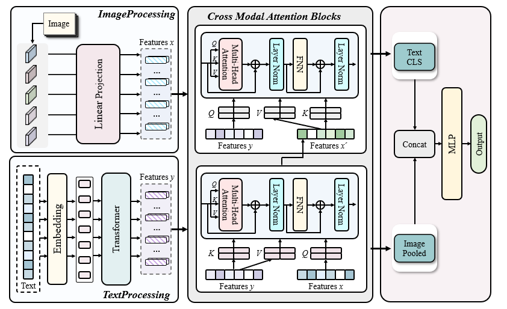

# 多模态情感分析--基于 CLIP 的多模态深度融合互注意力模型

## 项目简介
本项目为完成多模态情感分析任务，搭建并测试了多个模型，其中model_definition.py中的MultimodalCrossAttentionClassifier(见下图)和MultimodalClipClassifierWithAttention是主要的两个模型，使用CLIP和自定义的互注意力模块分别实现了图文之间的深度融合和浅层融合（具体方法见实验报告），在此基础上对要求的测试集完成了预测，保存在./src/test_without_label.txt

## 文件结构
```
本项目
├── logs
│   └── ...                 # 训练过程中的日志文件
├── models
│   └── clip-vit-base-patch32
│       └── ...             # CLIP 预训练模型相关文件
├── src
│   ├── data
│   │   └── ...             # 文本，图像数据文件
│   ├── model_arc.png       # 模型结构示意图
│   ├── test_without_label.txt # 测试集的最终预测
│   ├── train.txt           # 训练数据（图文对和标签）
│   ├── train_split.txt     # 训练集划分文件
│   ├── val_split.txt       # 验证集划分文件
│   ├── .gitignore          # Git 忽略配置文件
│── adaboost.py         # 使用 Adaboost 方法进行多模态情感分析
│── baseline_img.py     # 基于图像 baseline 模型
│── baseline_txt.py     # 基于文本 baseline 模型
│── bert_resnet_imgtxt.py # 结合 BERT 与 ResNet 进行图文特征提取的模型示
│── cross_modal_attention.py # 互注意力模块的具体实现，用于跨模态特征交互
│── data_preprocessing.py # 数据预处理脚本
│── draw.py             # 绘图脚本
│── model_definition.py # 主要模型定义文件 
│── predict.py          # 使用训练好模型对测试集进行预测输出
│── README.md           # 项目说明文件（本文档）
│── requirements.txt    # Python 依赖包列表
│── train.py            # 训练脚本（包含训练循环、超参数配置等）
```
## 环境要求
python版本：3.10
需要的包展示在requirement.txt中，可以使用```pip install -r requirement.txt```一键安装
## 超参数配置
模型超参数在model_definition.py里设置，训练超参数和选用的模型在train.py里设置（修改216，229行可以实现自定义的网格搜索）
## 运行程序
1) 先运行 ```python data_preprocessing.py``` 得到 train_split.txt & val_split.txt
2) 再运行 ```python train.py``` 进行训练+网格搜索
3) 最后运行 ```python predicate.py``` 得到预测文件
## 参考的仓库
[CLIP](https://github.com/openai/CLIP "OpenAI CLIP 项目")